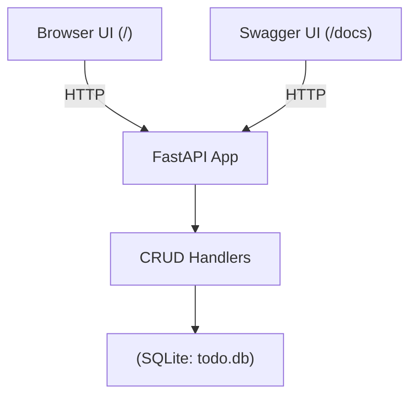
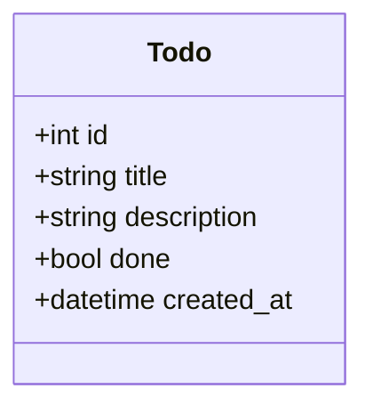

# SDLC Report — Minimal Todo API & UI (FastAPI + SQLite)

**Student:** Jack Samawi  
**Date:** 30 Sep 2025  
**Repository:** https://github.com/Jack-723/To-Do-List

---

## 1) Objective
Design and implement a **minimal software application** that can later be used for DevOps pipeline design. I built a **To-do list manager** with a Python FastAPI backend, SQLite persistence, and a tiny HTML UI. The app exposes REST endpoints for CRUD operations and includes documentation and diagrams.

---

## 2) Scope
**In scope**
- CRUD for todos (create/read/update/delete).
- Persistent local storage using SQLite (`todo.db`).
- Minimal UI:
  - Swagger docs at `/docs` (auto-generated).
  - Simple HTML front-end at `/` (form, list, search, filters, mark done, delete).
- Documentation: README + this SDLC report with diagrams.

**Out of scope (future work)**
- Authentication/authorization, users/roles.
- Cloud deployment & advanced CI/CD.
- External databases (e.g., PostgreSQL) and migrations.
- Automated testing suite (unit/integration).

---

## 3) Chosen SDLC Model & Justification
**Model:** **Incremental** (Agile-like in small steps).

**Why this model fits**
- Small, well-understood feature set (CRUD) → deliver quickly in slices.
- Allows early working software (first increment = API) and then iterate (UI, docs).
- Reduces risk by validating each increment locally (Swagger + HTML UI).

**Increments used**
1. **Scaffold**: repo, structure, dependencies, `.gitignore`.
2. **Features**: models, DB, CRUD endpoints, persistence.
3. **UI**: minimal HTML interface (no JSON typing required).
4. **Docs**: README + SDLC report.

---

## 4) Requirements

### 4.1 Functional Requirements
- FR1: Create a todo with `title`, optional `description`, and `done` flag.
- FR2: Read all todos and read one by id.
- FR3: Update fields of a todo (partial update).
- FR4: Delete a todo.
- FR5: Persist todos to local storage.

### 4.2 Non-Functional Requirements
- NFR1: API available locally on Python 3.11+.
- NFR2: Interactive API documentation at `/docs`.
- NFR3: Minimal UI at `/` requiring no JSON knowledge.
- NFR4: Clear project structure and code readability.

---

## 5) Architecture Overview

**Tech stack:** Python **FastAPI**, **SQLModel** (SQLAlchemy + Pydantic), **SQLite**.  
**Run-time:** Single process, local development server (Uvicorn).

### 5.1 Component / Data Flow



### 5.2 Data Model (UML/Class)



Files

app/models.py — Pydantic/SQLModel models.

app/db.py — engine + session + table creation.

app/crud.py — business logic (create/list/get/update/delete).

app/main.py — FastAPI app + routes + startup.

app/index.html — minimal HTML interface.

6) Development Phases
6.1 Planning

Choose a simple use case (Todo list) to satisfy the rubric’s “minimal app” requirement and enable DevOps pipeline work later.

6.2 Requirements

Capture functional/non-functional requirements above.

6.3 Design

Decide modules: models, db, crud, main, and a small static HTML page.
Keep endpoints RESTful: POST /todos, GET /todos, GET /todos/{id}, PATCH /todos/{id}, DELETE /todos/{id}.

6.4 Implementation

Build models with SQLModel; SQLite file DB.
Implement CRUD handlers and wire endpoints.
Add HTML UI that calls the same endpoints (form, list, search/filter, mark done, delete).

6.5 Testing

Manual API tests via Swagger /docs: verify create/list/get/update/delete and 404 handling.

UI tests at /: add tasks, mark done, delete, refresh, search, and filter (All / Active / Done).

Confirm todo.db persists data between runs.

6.6 Documentation

README.md: setup, run instructions, architecture summary.

REPORT.md: this document (SDLC model, diagrams, reflection).

7) Version Control Plan & Commit Log

Plan: At least 3 meaningful commits with descriptive messages.

Actual commits

Scaffold — project structure, requirements, .gitignore.
Example msg: chore: scaffold FastAPI project structure and setup

Features — full CRUD + persistence.
Example msg: feat: implement CRUD /todos with FastAPI + SQLite

UI — minimal HTML interface.
Example msg: Added HTML for user experience

Docs — README + SDLC report (this step).
Example msg: docs: add README and SDLC report

8) How This App Adapts to DevOps Practices (Reflection)

CI/CD: GitHub Actions workflow could run pip install -r requirements.txt, code formatting checks, and unit tests.

Containerization: Provide a simple Dockerfile with FastAPI + Uvicorn.

Testing: Expand to pytest + httpx for automated API tests.

Observability: Add logging/metrics in future.

Security: Use Dependabot/Renovate for dependencies; pre-commit hooks.

Config: Move DB and secrets to environment variables.

Scalability: Replace SQLite with PostgreSQL and use multiple workers for production.

## 9) Run & Use (summary)
```bash
python -m venv .venv
# Windows: .venv\Scripts\Activate
# macOS/Linux: source .venv/bin/activate
pip install -r requirements.txt
uvicorn app.main:app --reload
```

Open:

/docs → Swagger UI to test endpoints.

/ → HTML UI (add, search/filter, mark done, delete).

10) Risks & Mitigations

Dependency issues: Pin versions in requirements.txt; use virtualenv.

Data loss: SQLite is a local file; keep backups of todo.db.

Time constraints: Scope kept minimal to meet deadline.

Future changes: Logic isolated in crud.py to ease refactoring.

11) Future Work

Authentication & multi-user support.

Automated test suite + CI.

Docker image + cloud deployment.

Switch to PostgreSQL with migrations.

More advanced front-end (e.g., React).